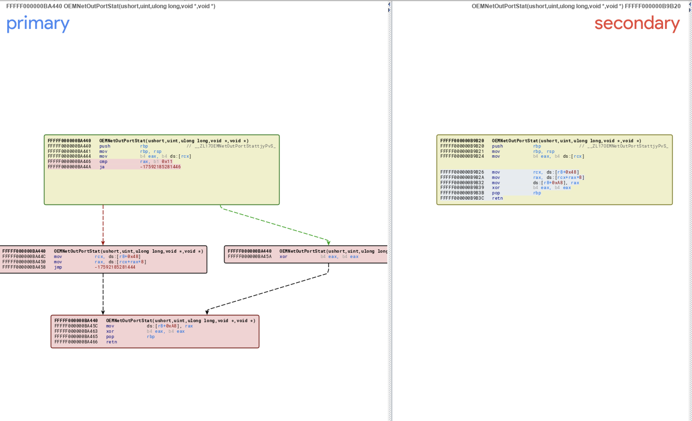
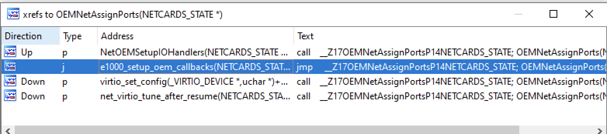
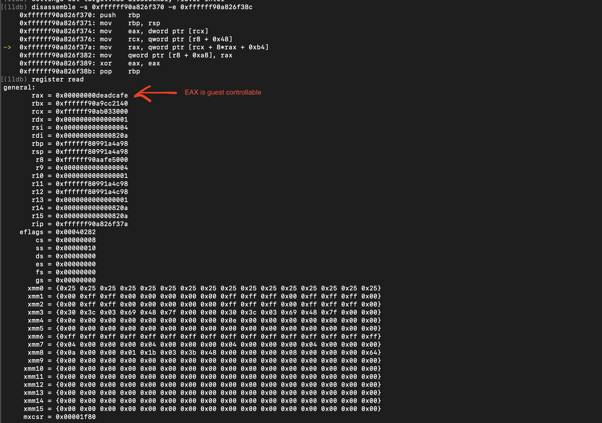
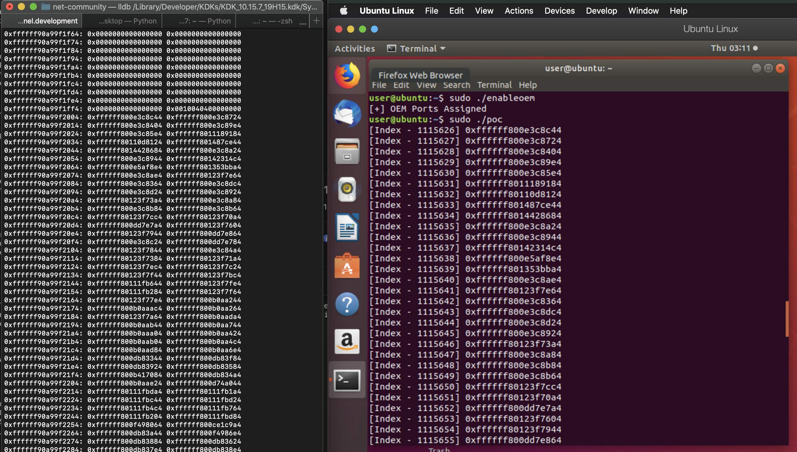

Recently I decided to take a look at Parallels Desktop and started with diffing between previous releases. We can see on [Parallels Security KB](https://kb.parallels.com/en/125013) that a lot of vulnerabilities have recently been fixed in parallels, especially in 16.0.0 so that looks like a good starting point to find some patched bugs.

## OEMNet Out-Of-Bound Read

Diffing between version 15.x and 16.x is of not much help at first since bindiff reports a lot of changes which makes everything harder for us. But with some careful review I noticed an interesting change in the function named OEMNetOutPortStat. Looking at the diff its pretty much clear that an Out-Of-Bound Read is being patched here. 

<p align="center">
  
<br>
</p>

From the name of function its pretty much clear that this function comes into play when writing to an specific OEMNet I/O port. I couldn't find any public information about OEMNet but from the code it looked like a network device. After digging for some more time and understanding a few other things related to this device I decided it was time to gather some more information about this patch. Seeing the patch, its pretty much clear that "data" variable is guest-controllable which indeed it is. 
<br>

```C
__int64 __fastcall OEMNetOutPortStat(unsigned __int16 a1, unsigned int a2, unsigned __int64 a3, void *data, net_device *a5)
{
  a5->stat_store = *(_QWORD *)(a5->stat_info + 8LL * *(unsigned int *)data + 0xB4);
  return 0LL;
}
```

```C
__int64 __fastcall OEMNetInPortStat(unsigned __int16 a1, unsigned int a2, unsigned __int64 a3, void *data, net_device *a5)
{
  *(_DWORD *)data = a5->stat_store;
  a5->stat_store = HIDWORD(a5->stat_store);
  return 0LL;
}
```

In the OEMNetOutPortStat function, "data" or to be precise the value written to this I/O port is being used to calculate the index which is used to retrieve a value from stat_info array and is stored in the variable named stat_store. The guest can later retrieve this value by reading from the same I/O port as we can see in the definition of OEMNetInPortStat. The problem here was that we are not validating "data" before calculating the index and reading from the array.

After spending some time about understanding the vulnerability it was pretty clear that we can read 0xffffffff * 8 - sizeof(stat_info)) bytes after the array. Now interesting thing here is that OEMNetOutPortStat is present in the monitor which is a ring 0 component, so the guest can basically read that many bytes from the host kernel memory after the stat_info array or atleast till we encounter a page fault. Also one thing to note here is it looks like the stat_info structure is allocated in DMM (Dynamic Monitor Memory) which from the code looks like is a memory space which is managed by the monitor for its own allocations so simply overreading stat_info would just provide us the contents of DMM allocation which should only contain monitor related data, we will have to overread the whole DMM allocation to read something which can probably be used in further exploitation, as this vulnerability allows us to read (0xffffffff * 8 - sizeof(stat_info)) bytes it should be easy to get a solid info leak. 

At this point I had a good understanding of the vulnerability but still some work was left to figure out how to trigger this vulnerability. OEMNet looks like a network device judging from the function names and strings, by default nothing happens when writing to OEMNET_IO_STAT_PORT so seems like we have an additional task of activating these I/O ports. Digging a bit more I saw a function named OEMNetAssignPorts which is used to setup OEM I/O ports, this function is called from 4 places as shown below.

<p align="center">
  
<br>
</p>

I chose to start from the function e1000_setup_oem_callbacks just because e1000 is pretty common device and I had some understanding of it (which didn't come of any use here though). So looking at e1000_setup_oem_callbacks it just sets up some NULL I/O handlers and some function callbacks and then calling OEMNetAssignPorts, going one more step up we see that e1000_setup_oem_callbacks is actually being called from e1000_out_port_addr which itself is an I/O port handler. So it looks like we can enable OEMNet I/O ports from e1000_out_port_addr handler, the string "e1000_reassign_to_oem" in this function gives us a fair hint. After some reverse engineering I finally figured how to activate the OEMNet device from the guest. 

```C
__int64 __fastcall e1000_out_port_addr(char a1, int a2, int a3, void *a4, void *a5, int a6)
{
.........
  if ( a2 == 4 && *(_DWORD *)a4 == 0x1AB8400E )
  {
.........
      __LogMessage(
        4,
        (unsigned int)"[card %d] e1000_reassign_to_oem",
        *((unsigned __int8 *)a5 + 106),
        (_DWORD)a4,
        (_DWORD)a5,
        a6);
.........
        e1000_reset((char **)a5 + 0x99A8, (__int64)v9, (__int64)v14, (int)v13, v11, v12);
        net_post_vmapp_request(*((unsigned __int8 *)a5 + 106), 3LL, 0LL);
        e1000_setup_oem_callbacks((char *)a5);
.........
  return 0LL;
}
```

Looking at this I/O handler we know "data" is guest-controllable, and we see that it compares value written to I/O port with what looks like a magic value (0x1AB8400E) and if this passes it goes ahead and resets the e1000 device and enables the OEMNet device. Without reversing any further I tried this and it seemed to work fine, just by writing 0x1AB8400E to the lowest e1000 I/O port the OEMNet device got activated. Once the OEM ports are assigned we can test the OEMNetOutPortStat handler and confirm that "data" is guest-controllable.

<p align="center">
  
 <br>
</p>

And now we have all the required information to write a POC and leak some memory from the host kernel.

### POC:

```C
for( index = 0; index < qwords_to_leak; index++ ) {
    outl(index, OEMNET_IO_STAT_PORT);
    low = inl(OEMNET_IO_STAT_PORT);
    high = inl(OEMNET_IO_STAT_PORT);
    printf("[Index - %d] 0x%lx\n", index, ((high << 32) + low));
}
```

The POC is pretty simple, we write an index to I/O port which then stores 8 bytes into stat_store from that index, after that we read from I/O port twice as it returns 4 bytes at a time which can be seen in the function OEMNetInPortStat. Finally as we run the poc we can see a lot of interessting host kernel leaks.

<p align="center">
  
<br>
</p>

### Conclusion:

It seems like this vulnerability was patched in Parallels Desktop 16.x and all the previous versions before this should be vulnerable to this. Searching about OEMNet bugs in Parallels Desktop I came across [ZDI-20-1012](https://www.zerodayinitiative.com/advisories/ZDI-20-1012/), from title it looks like an OEMNet Out-Of-Bound read which was fixed in 16.x but due to the limited information in the advisory its tough to make any assumptions if this vulnerability is same or not.
